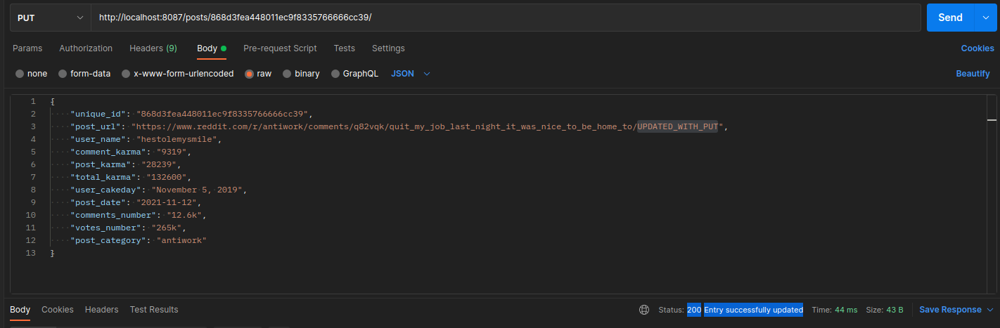

# REDDIT SCRAPER
## You may scrape but don't you rape!    
#### ABOUT
This Reddit scraper collects info on posts and their author from a given reddit web-page.
The collected info is saved to a txt-file, while the logging info to 
a log file. CRUD-operations on the output file are performed via simple RESTful API.
#### INSTALLATION 
1. `Mkdir` on  your machine and create a virtual environment down there with Python >= 3.9.
2. Download files from this repo and place them next to the folder with your newly created virtenv.
3. Install the packages from *requirements.txt* file into your virtenv folder
(either with `$ pip install -r requirements.txt` or with the package-manager you'd normally do this).
4. To run the scraper you'll need [Chrome browser](https://www.google.com/chrome/)
on your machine as well as [ChromeDriver](https://chromedriver.chromium.org/) of a corresponding version.
To find out which version of ChromeDriver you need, open your Chrome browser, hit *Customize and control Google
Chrome -> Settings -> About Chrome*.
5. To run CRUD-operations on the output file you will either need your favourite command line
util, or a GUI app. [Postman](https://www.postman.com/downloads/) will come in handy. 

#### LAUNCHING AND USING
Move to the folder with the downloaded files from this repo, open the terminal and run `python manin.py --help`.
You will see arguments you'll need to provide with dash-dash flags to run the program. Here's the demo.
> $ python main.py --help
> 
> usage: main.py [-h] [--chromedriver-path CHROMEDRIVER_PATH] [--target-dir-path TARGET_DIR_PATH] [--url URL] [--number NUMBER]
[--host HOST] [--port PORT] [--server SERVER]

Thus, your command should follow this pattern...
> $ python main.py --chromedriver-path `/path/to/folder/with/chromedriver`
> --target-dir-path `/path/to/folder/to/load/scraping/results/and/logs` --url `https://www.reddit.com/`
> --number `quantity of posts you'd like to scrape` --host `host address (localhost)` --port
> `port to launch webserver on` --server `name of the webserver running on the given address `

As is, all the arguments, **NB!** except `--chromedriver-path` and  `--target-dir-path`, 
are optional for you and by default they are as follows:   

--url `https://www.reddit.com/top/?t=month`  
--number `100`  
--host `localhost`  
--port `8087`  
--server `reddit-scraper`   

To make the first two commandline arguments fully optional as well, i.e. to hardcode them, open the
`settings.py` file and overwrite your `--chromedriver-path` and `--target-dir-path` in the corresponding constants.
If you wish to, there you can also change all the other _default_ values.
If you do this, you will this way change the default values of dash-dash flags and can just run
> $ python main.py
> 
After you launch the script, it will collect enough raw info from the webpage, process it and
temporarily place in into a collector-dict (so, it will be in the RAM). To further save the
entries into a file, open the `Postman` and use the following uris for the corresponding CRUD.
Here is the scheme:   

`http://localhost:8087/posts/` with `PUT`
--> to fetch first entry from the RAM and save it into the file.  
`http://localhost:8087/posts/` with `GET`
--> to get all the entries already saved into the file.  
`http://localhost:8087/posts/UNIQUE_ID/` with `GET`
--> to get a specific entry already saved into the file.  
`http://localhost:8087/posts/UNIQUE_ID/` with `PUT`
--> to update a specific entry from the file.  
`http://localhost:8087/posts/UNIQUE_ID/` with `DELETE`
--> to get rid of a specific entry from the file.  

Here are some API **demos**:  

`http://localhost:8087/posts/` with `PUT`
  

`http://localhost:8087/posts/` with `GET`
  

`http://localhost:8087/posts/UNIQUE_ID/` with `PUT`
  

Go try reddit scraper!

#### DISCLAIMER
You are strongly discouraged to abuse the program and run massive and frequent requests
to the Reddit servers. Remember, you may scrape but don't you rape!